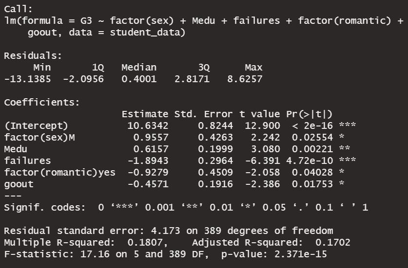
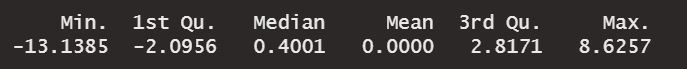
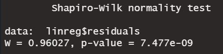
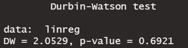
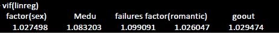

# Student's Grade Prediction
## Predictive modelling & Linear Regression with R 

###  Building of the model 
We are looking to create a predictive model capable of giving the final grade of a student in regard to some explanatory variables.

We will do that by performing a multiple linear regression to build a model estimating the performance of the students, based on the different
variables observations we had after cleaning our data.

Our dataset is made of different observations of 395 students, provided by the [UCI Machine Learning Repository](https://archive.ics.uci.edu/ml/datasets/Student+Performance).

We used a backward method on our linear regression to obtain this final model, keeping only the significant variables (p-value < 5%)

We found a R squared of 17,02% wich is low but can be explained by the fact that there are probably many other variables which could explain the final grade of the students. 
We also have a relatively small dataset. Having more observations would give us a greater power to detect patterns or differences and thus increase our predictive power.

### Hypothesis analysis

To assess the validity of our model, we will test the hypothesis of the residuals (mean of residuals = 0, normal distribution, homoscedasticity and absence of autocorrelation) and of the significant variables (no multicollinearity).

##### Mean of the residuals

The mean of our residuals is effectively equal to 0 

##### Normal distribution of the residuals

We test the normal distribution of our residuals with the Shapiro-Wilkinson test:

The p-value is < 5%.
We reject H0 so the residuals are not normally distributed.
The assumption of the normality of the residuals is not the most invalidating. The sample size is large enough (> 30 observations) so the results of the model remain valid, even if the assumption of normality is not verified.

##### Homoscedasticity of the residuals

We test the homoscedasticity of our residuals with the Breusch Pagan test:

The p-value is > 5%, so we accept the homoscedasticity hypothesis

#####  Absence of autocorrelation between the variables

We try to detect the absence of autocorrelation thanks to the variance inflation factors (VIF).

##### No multicollinearity among variables

All VIF are < 5, so there is no multicollinearity among the variables of our model. 

### Conclusion

Our model can be used to forecast the grades of students, but with some precautions. 
The R-square we obtained is indeed relatively small, and we would need more significant observations of the students' habits and profiles to add more accuracy to our predictive model. 
